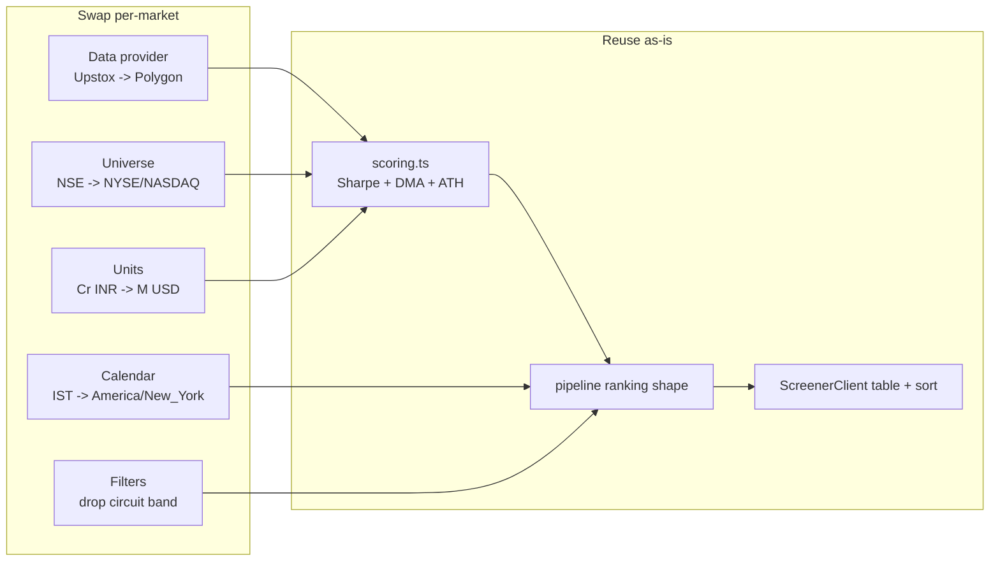
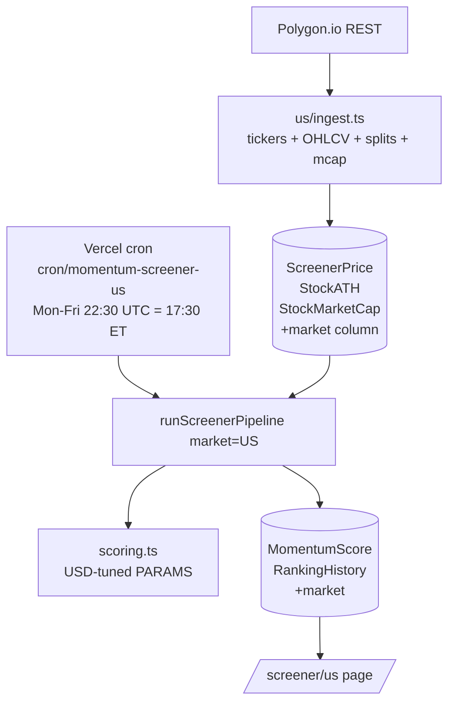

## Goal

Apply Alpha's existing momentum strategy (avg of 12m/6m/3m Sharpe + 200 DMA / ATH proximity / liquidity filters) to **US equities** as a separate page (`/screener/us`), without disturbing the Indian screener at `/screener`.

## Strategy reusability

The math in [src/lib/screener/scoring.ts](src/lib/screener/scoring.ts) is market-agnostic — Sharpe, DMAs, ATH proximity, median turnover all transfer cleanly. **What must change is the data layer, the universe, the calendar, the currency, and a couple of filters** (circuit bands are SEBI-only; the ₹50 minimum price and ₹1 Cr turnover threshold need USD equivalents).

## Recommended data provider: Polygon.io

Evaluated against requirements (5+ yrs daily OHLCV for ~3000 names, splits/dividends, market cap, ticker reference, US holidays):

- **Polygon Stocks Starter (~$29/mo)** — unlimited API calls, 5 yrs history, splits + dividends + ticker details + market status endpoint. Cleanest fit; one provider covers ingestion + corporate actions + calendar.
- Alpha Vantage — free tier is 25 req/day on the new pricing; not viable for ~3000 tickers.
- Yahoo via `yahoo-finance2` — free fallback, but ToS-grey and rate-limited; acceptable for prototyping only.
- FMP — usable but split across more endpoints; market-cap fundamentals data quality is mixed.
- Alpaca/IBKR — overkill unless you also want US brokerage holdings sync (out of scope here).

**Plan assumes Polygon**, but the data layer will be isolated behind a `UsMarketDataClient` interface so swapping is one file.

## Architecture

A `market` dimension is added to screener-only tables (default `'IN'` for backfill) and the existing IN code paths are unchanged. A new `/screener/us` route runs the same pipeline against US-scoped data. Holdings, transactions, and dashboards stay India-only for this phase.

## Concrete changes

### 1. Schema — add `market` to screener tables

Update [prisma/schema.prisma](prisma/schema.prisma):

- Add `market String @default("IN")` to `ScreenerPrice`, `StockATH`, `StockMarketCap`, `MomentumScore`, `RankingHistory`, `ScreenerDemerger`, `SectorMapping`.
- Change uniques to include `market`: e.g. `@@unique([market, symbol, date])` for `ScreenerPrice`, `@@unique([market, computedDate, symbol, rankType])` for `MomentumScore`.
- Migration backfills existing rows to `'IN'` (no user-facing change for IN screener).

### 2. New data layer — Polygon client

Add [src/lib/us-market/polygon-client.ts](src/lib/us-market/polygon-client.ts) with:

- `getActiveTickers()` → `/v3/reference/tickers?market=stocks&active=true&type=CS` (Common Stock; optionally also `ETF`).
- `getDailyAggregates(symbol, from, to)` → `/v2/aggs/ticker/{sym}/range/1/day/{from}/{to}` (already split-adjusted).
- `getTickerDetails(symbol)` → market cap, listing exchange.
- `getSplits(symbol)` → `/v3/reference/splits` (for anomaly cross-check).
- `getMarketStatus()` and `getMarketHolidays()` → calendar.

Rate-limited with a small queue; auth via `POLYGON_API_KEY` in `.env`.

### 3. US-scoped helpers

- [src/lib/us-market/dates.ts](src/lib/us-market/dates.ts) — `todayET()`, `effectiveTradingDayUS()`, `isUSMarketOpen()`. Mirrors [src/lib/screener/dates.ts](src/lib/screener/dates.ts) but in `America/New_York` with NYSE session 09:30–16:00 and `getMarketHolidays()` from Polygon.
- [src/lib/us-market/universe.ts](src/lib/us-market/universe.ts) — filters ticker reference to NYSE/NASDAQ/AMEX common stock (and optionally ETFs); excludes preferreds, units, warrants by `type`/suffix; persists to a new lightweight `UsInstrument` cache table or in-memory map refreshed weekly.

### 4. Scoring — parameterize INR-specific thresholds

Refactor [src/lib/screener/scoring.ts](src/lib/screener/scoring.ts) to take `PARAMS` as an argument (or expose `PARAMS_IN` and `PARAMS_US`):

- `mcapMinUsdM: 300` (≈ ₹2500 Cr equivalent — keeps small-cap inclusion but drops microcaps; tunable).
- `volumeThresholdUsdM: 5` (median 6-month daily $ volume ≥ $5M; rough USD analog of ₹1 Cr).
- `minPrice: 5` (US "penny stock" line; many brokers/screens exclude < $5).
- Drop `ETF_WHITELIST` for IN ETFs; if including US ETFs, exempt them by `type === 'ETF'` from min-price.
- `medianTurnoverCr` field renamed/aliased; keep numeric internals, change only display formatter.

Also rename `circuitBandPct` handling in [src/lib/screener/pipeline.ts](src/lib/screener/pipeline.ts) to be IN-only (skip the band filter and column entirely when `market === 'US'`).

### 5. Pipeline — make it market-aware

In [src/lib/screener/pipeline.ts](src/lib/screener/pipeline.ts):

- Accept `{ market: 'IN' | 'US' }`.
- Load symbols from market-scoped universe.
- Read prices/ATH/mcap with `where: { market }`.
- Skip the circuit-band step when `market === 'US'`.
- Write `MomentumScore` / `RankingHistory` with `market` set.
- For the **portfolio exemption**, pass an empty set when `market === 'US'` (no broker holdings yet).

### 6. Ingestion — new cron

Add [src/app/api/cron/momentum-screener-us/route.ts](src/app/api/cron/momentum-screener-us/route.ts) modeled on the IN cron:

1. Refresh US universe weekly (skip on weekday runs, run on first weekday of month).
2. Fetch yesterday's daily aggregate per symbol; upsert into `ScreenerPrice` with `market='US'`.
3. Refresh `StockMarketCap` weekly using `getTickerDetails`.
4. Update `StockATH` (US tickers seeded from `/v2/aggs/.../range/1/month/2000-01-01/today`).
5. Run `runScreenerPipeline({ market: 'US' })`.

Add to [vercel.json](vercel.json): `"path": "/api/cron/momentum-screener-us", "schedule": "30 22 * * 1-5"` (= 17:30 ET, after US close + a buffer for Polygon EOD finalization). Set `maxDuration` consistent with IN cron.

For initial seeding, add [scripts/seed-us-screener-prices.ts](scripts/seed-us-screener-prices.ts) that pulls ~270 trading days per symbol in batches.

### 7. Page + UI

- New route [src/app/screener/us/page.tsx](src/app/screener/us/page.tsx) that calls `getScreenerData('prefiltered', { market: 'US' })`.
- Update [src/app/actions/screener.ts](src/app/actions/screener.ts) to accept `market` and pass it through queries; keep default `'IN'`.
- Add a market switcher to [src/components/screener/ScreenerClient.tsx](src/components/screener/ScreenerClient.tsx) (link tabs: India / US) — minimal, no shared state.
- Format helpers: `formatMcap` / `formatTurnover` accept `market`; render `$X.XB` / `$YYM` for US instead of `XXXX Cr`.
- Hide the circuit-band column on US tab.
- Update [src/components/screener/RulesInfoModal.tsx](src/components/screener/RulesInfoModal.tsx) with US rules copy.

### 8. Out of scope (call out, do not build)

- Portfolio tab for US (needs a US broker integration — Alpaca/IBKR/Schwab).
- US news, US dashboard, US daily report email.
- Demerger handling for US (use Polygon splits feed only; spinoffs are rare enough to defer).
- Sector mapping for US (can pull from Polygon `sic_description`/`sic_code` in a follow-up).

## Risks & decisions to confirm before build

- **Polygon plan cost** (~$29/mo) — confirm acceptable, or start on free tier with reduced universe (top ~100 by mcap) for prototyping.
- **Universe size** — full US common stock is ~6000 tickers; the pipeline currently runs ~1500 NSE names in one cron slot. Recommend capping initial US universe to top ~3000 by market cap to fit within Vercel cron `maxDuration`.
- **Threshold tuning** — the proposed USD thresholds ($5 min price, $5M median turnover, $300M mcap floor) are educated starting points. Should be backtested before treating outputs as actionable; the plan does not include a US backtest harness (the existing Python backtest in `backtest/` is NSE-only).
- **ETF inclusion** — including SPY/QQQ etc. will dominate ranks during trends; recommend excluding ETFs from the default US universe and showing them on a separate sub-tab if desired.
